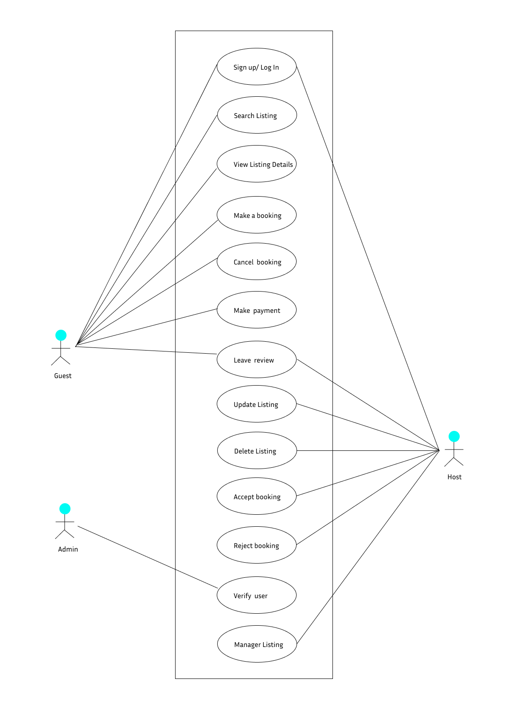

# Requirement Analysis in Software Development  
This documentation is dedicated to documenting the Requirement Analysis phase for the Airbnb-clone project. It aims to capture and clarify the essential needs of the system before development begins. The document within this repo will cover:  

- A clear explanation of Requirement Analysis and its importance in the Software Development Lifecycle (SDLC).
- A breakdown of Functional and Non-functional Requirements, including how they differ.
- Key reasons why Requirement Analysis is critical in successful software development.
- The core activities involved in conducting Requirement Analysis.
- An illustration of how Use Case Diagrams support the identification and communication of system functionality.
- Guidance on establishing and applying Acceptance Criteria to validate requirements during testing and delivery.  

The purpose of this analysis is to ensure that the development of the Airbnb clone is guided by a solid understanding of user and system expectations, reducing risks and aligning the final product with project goals.

## What is Requirement Analysis?  
This is a critical phase in SDLC where the project team **gathers**, **analyzes**, and **defines** the requirements of the software development product to be developed. It helps define what the client wants, what users expect, and what the development team must build.  

## Why is Requirement Analysis Important?  
**1. Clarity and Understanding** - Developers, designers, testers, and stakeholders share a common understanding of the project's goals. This shared understanding prevents confusion and rework later.    
**2. Scope definition** - It helps define the scope of the project, meaning what will be included and what won’t. This avoids feature creep (adding more than originally planned) and helps manage expectations.  
**3. Basis for design and development** - It provides the foundation for the next stages: system design and development. Designers use requirements to create the user interface and user experience. Developers use them to write the logic and build the actual features.   
**4. Quality assurance** - Clearly defined requirements serve as a benchmark for testing the software. Testers use them to create test cases and validate whether the system behaves as expected.  

## Key Activities in Requirement Analysis
Requirement Analysis involves several essential activities that help transform vague ideas into clear, actionable requirements. The five key activities are:

### 1. Requirement Gathering
- Involves collecting initial information from stakeholders, users, and other sources. It helps identify business needs, project goals, and user expectations.
- Techniques include interviews, questionnaires, workshops, and reviewing existing documentation.

### 2. Requirement Elicitation
- A deeper process of uncovering hidden, implied, or overlooked needs. Ensures the team understands both what users say they want and what they need.  
- Engages stakeholders through brainstorming, focus groups, and prototyping.

### 3. Requirement Documentation
- Captures the gathered and elicited requirements in a structured and readable format.
- Documents include Software Requirement Specifications (SRS), user stories, and use cases.
- Ensures consistency, traceability, and serves as a reference for development and testing.

### 4. Requirement Analysis and Modeling
- Involves organizing, classifying, and refining requirements.
- Models like use case diagrams, flowcharts, or ER diagrams help visualize and structure the system.
- Helps identify conflicts, redundancies, and missing elements.

### 5. Requirement Validation
- Confirms that the documented requirements are complete, correct, and aligned with stakeholder needs.
- Involves reviews, walkthroughs, and stakeholder approval sessions.
- Ensures that the requirements are feasible, testable, and clearly understood before development begins.

## Types of Requirements
### a) Functional Requirements

Functional requirements describe the specific **features and behaviors** the system must support. Simply stated, they describe what the system should do.  

####  Functional Requirements Examples for the Booking Management System:

- **User Authentication:** Users must be able to sign up, log in, and log out securely.
- **Property Listing:** Hosts should be able to create, update, and delete property listings with photos, descriptions, and pricing.
- **Search and Filter:** Guests should be able to search for listings based on location, date, number of guests, and price range.  
- **Payment Integration:** The system must support payment processing via secure gateways like Stripe or PayPal.

### b) Non-functional Requirements

Non-functional requirements define the **quality attributes** of the system. They essentially describe how the system should perform.  

#### Non-functional Requirement Examples for the Booking Management System:

- **Scalability:** The application must support thousands of users making bookings simultaneously without performance degradation.
- **Performance:** Ensure fast loading times. Search results should load in under 2 seconds.
- **Availability:** The system must be available 99.9% of the time (high availability).
- **Usability:** The interface must be intuitive and responsive across desktop and mobile devices. Prioritize mobile responsiveness.

## Use Case Diagrams

A **Use Case Diagram** This is a type of diagram that visually represents the interactions between users (**actors**) and the system (**use cases**). It helps identify what the system should do from an external point of view.

### Benefits of Use Case Diagrams:
-   Provide clear visual og system functionalities.  
-   Help organize and identify system requirements.  
-   Facilitate communication among stakeholders and the development team.  
  
### Use Case Diagram for Booking System

## Acceptance Criteria  
They are conditions or requirements that a feature must meet to be accepted by the user, customer, or other stakeholders.   

### Importance of Acceptance Criteria in Requirement Analysis
- Provide a basis for testing and validation.
- Help in maintaining quality and meeting user expectations.
- Ensure all parties have a clear understanding of feature requirements.

### Example: Acceptance Criteria for Checkout Feature in Booking Management System
- Given the user has selected a listing and entered valid dates,  
When they click "Book Now" and complete payment,  
Then the booking should be confirmed and a summary sent via email.
- Given the user has selected a listing and specific dates,  
When they proceed to the checkout page,  
Then the system should display a breakdown of total cost including nightly rate, service fees, taxes, and any additional charges.

